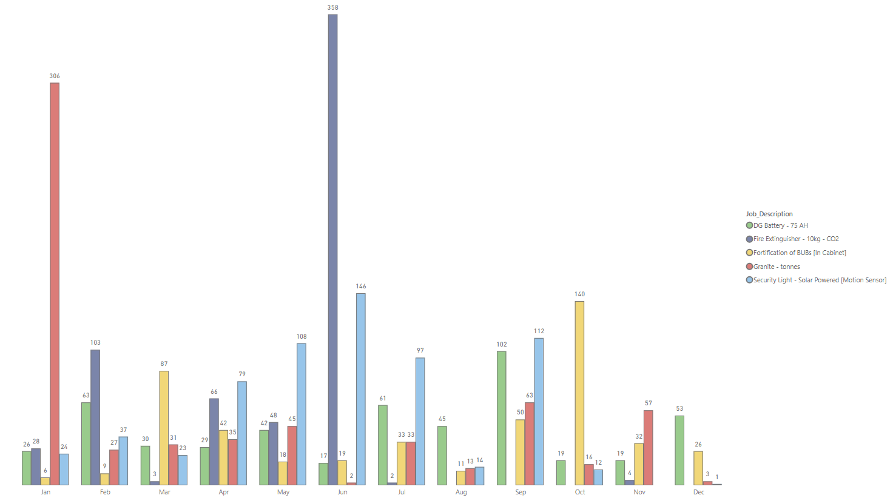

# Corrective Maintenance Analysis


[Datasets](assets/datasets)
[Interactive Report](https://app.powerbi.com/view?r=eyJrIjoiNzYwODcyYjEtYjhhOC00N2VjLTlmMjEtMjQ0NjRhMDY4MmZjIiwidCI6ImRmODY3OWNkLWE4MGUtNDVkOC05OWFjLWM4M2VkN2ZmOTVhMCJ9)  

## Table of Contents

- [Objective](#objective)
- [Spreadsheet (Excel) Tasks](#spreadsheet-excel-tasks)
  - [Creating a Job Code Column](#creating-a-job-code-column)
  - [Job Classification](#job-classification)
  - [Payment Classification](#payment-classification)
- [Python (Pandas) Analysis](#python-pandas-analysis)
  - [Data Loading and Inspection](#data-loading-and-inspection)
  - [Data Cleaning](#data-cleaning)
  - [Date Conversion for Analysis](#date-conversion-for-analysis)
  - [Data Renaming](#data-renaming)
  - [Exploratory Data Analysis (EDA)](#exploratory-data-analysis-eda)
- [SQL Analysis](#sql-analysis)
  - [Database Setup](#database-setup)
  - [Data Import and Joins](#data-import-and-joins)
  - [Handling Unit Price Issues](#handling-unit-price-issues)
  - [SQL Exploratory Data Analysis](#sql-exploratory-data-analysis)
- [Power BI Visualizations](#power-bi-visualizations)
  - [Data Import from SQL](#data-import-from-sql)
  - [Data Transformation in Power Query](#data-transformation-in-power-query)
  - [Data Modeling](#data-modeling)
  - [Visualizations and Insights](#visualizations-and-insights)
    - [Profitability Analysis](#profitability-analysis)
    - [Job Efficiency](#job-efficiency)
    - [Resource Allocation](#resource-allocation)
    - [Cost Optimization](#cost-optimization)
- [Project Summary](#project-summary)


## Objective
The primary goal of this project is to streamline and optimize telecom maintenance processes by leveraging tools such as Excel, Python, SQL, and Power BI. This involves:
- Detecting and managing duplicated jobs efficiently.
- Classifying job types, faults, and payment methods for better categorization and tracking.
- Cleaning and preparing data for insightful analysis.
- Conducting exploratory data analysis to uncover trends and inefficiencies.
- Developing visualizations and KPIs to support decision-making on profitability, job efficiency, resource allocation, and cost optimization.
By addressing these objectives, the project aims to enhance operational efficiency and provide actionable insights for better management and financial outcomes.


## Spreadsheet (Excel) Tasks
### Creating a Job Code Column
A job code column was created to detect repeated jobs effectively. This was achieved using the formula:  
`=[@[ihs_id]]&" - "&[@fault]`  
This combines the `ihs_id` and `fault` columns, making it easier to identify duplicate job entries.

### Job Classification
Jobs were classified based on fault descriptions to group them systematically. The formula used included nested conditions with `SEARCH`, `IF`, and `INDEX` functions to categorize faults based on keywords. Additionally, the formula relied on external references to a `dimensions.xlsx` file for group assignments, defaulting to "Crosscheck" for uncategorized jobs.

### Payment Classification
Payment references were categorized based on their prefixes, enabling a clear distinction between payment types such as "Warehouse," "Outsource," and "Employee." This was implemented using a nested `IF` formula that analyzed the `payment_ref` column for specific patterns, e.g., `"MRF"`, `"PO-"`, and `"Vendor"`.


## Python (Pandas) Analysis
### Data Loading and Inspection
The dataset was loaded using `pandas` for analysis. Initial steps included inspecting the column names and checking for missing values. Key columns such as `approval_date`, `closure_date`, and `payment_ref` were identified to have missing values that required attention.

### Data Cleaning
To prepare the data for analysis:
- The `approval_date` column was converted to a datetime format using `pd.to_datetime`.
- Rows with missing `approval_date` values were dropped.
This reduced the dataset to 8,406 rows, ensuring consistency and accuracy.

### Date Conversion for Analysis
Columns such as `rto_validation` and `revenue_month` were converted to a month/year format (`Period[M]`) to facilitate temporal analysis. This enabled effective month-to-month comparisons.

### Data Renaming
Column names were renamed for better clarity and usability. For example:
- `jobcode` was renamed to `Job_Code`.
- `request_date` was renamed to `Request_Date`.
This standardized naming conventions, improving readability and ease of use during analysis.

### Exploratory Data Analysis (EDA)
Basic exploratory analysis provided key insights:
- **Total Number of Requests:** 8,406.
- **Total Closed Jobs:** 7,972.
- **Total Approved Amount:** Approximately 604 million.
These initial insights set the stage for deeper analysis into job efficiency and financial performance.
[Notebook Link](assets/docs/cm_data_EDA.ipynb)

## SQL Analysis
### Database Setup
A dedicated database, `TelecomMaintenance`, was created to manage and analyze the telecom maintenance data efficiently. This structured environment allowed for seamless querying and integration of cleaned data.

### Data Import and Joins
The cleaned dataset (`cleaned_data.csv`) was imported into a table named `nr`. A join operation was performed with the `class` table to integrate job classifications using the `Job_Description` field. Missing values in the classification were filled with a default value, `Other Capex`, using the `COALESCE` function.
**Example Query for Data Import and Joins:**
```sql
SELECT nr.Request_date, 
       nr.Site_ID, 
       nr.Job_Type, 
       nr.Job_Description, 
       COALESCE(class.project, 'Other Capex') AS project
FROM nr
LEFT JOIN class ON nr.Job_Description = class.fault;
```

### Handling Unit Price Issues
To ensure financial analysis accuracy, rows with a unit price of zero were excluded from the dataset.
Query to Exclude Rows with Zero Unit Price:
```sql
SELECT * 
FROM nr 
WHERE Unit_Price <> 0;
```

### SQL Exploratory Data Analysis (EDA)
Key exploratory analyses were conducted to uncover trends and patterns, including:
#### Most Frequent Jobs
Identified the top 10 most requested job descriptions.
Query to Find Most Frequent Jobs:
```sql
SELECT TOP 10 
       Job_Description, 
       COUNT(*) AS Job_Count
FROM nr
GROUP BY Job_Description
ORDER BY Job_Count DESC;
```
#### Revenue Trend
Summarized monthly revenue trends by calculating approved quantity and unit price.
Query for Revenue Trend:
```sql
SELECT DATEPART(MONTH, Request_Date) AS Month, 
       SUM(Qty_Approved * Approved_Unit_Price) AS Monthly_Revenue
FROM nr
GROUP BY DATEPART(MONTH, Request_Date)
ORDER BY Monthly_Revenue DESC;
```
#### Profitability Analysis
Examined average expenses, revenues, and profit margins per job type, while considering job count distribution.
Query for Profitability Analysis:
```sql
SELECT Job_Type, 
       COUNT(Job_Type) AS Distribution, 
       AVG(Qty_Used * Unit_Price) AS Avg_Expense, 
       AVG(Qty_Approved * Approved_Unit_Price) AS Avg_Revenue, 
       (AVG(Qty_Approved * Approved_Unit_Price) - AVG(Qty_Used * Unit_Price)) AS Profit
FROM nr
GROUP BY Job_Type;
```


## Power BI Visualizations
### Data Import from SQL
To begin the analysis, the dataset was imported into Power BI using a direct query method. The `non routine` table, representing the fact table, was connected to the Power BI report by providing the server and database details. This approach enabled real-time querying and kept the data up-to-date.

### Data Transformation in Power Query
Data transformation was done within Power Query to clean and refine the dataset:
- **Data Types**: Initially, the appropriate data types for each column were set, but later the query mode was switched to import mode for better control over transformations.
- **Creating New Columns**: 
  - **Total Expenses** and **Total Approval** columns were added using "Columns from Example" to reduce the size of `site_ids`, simplifying the data.
  - This involved trimming `site_ids` to the most relevant parts (e.g., `MYPROJ_ABE_0008B` was transformed to `ABE_0008B`) and applying the same logic to the `matrix` dimension table.
- **Job Type Name Refinement**: Vague job type names were standardized to improve clarity. For example, job descriptions like "site cleanup/fe," "site cleanup/tower painting," and "spares – charging alternator" were modified to "fire extinguisher," "tower painting," and "charging alternator," respectively.

### Data Modeling
- **Calendar Table**: A calendar table was created using the `CALENDAR` function for time-based analysis, incorporating columns for year, month, quarter, etc.
```DAX
Calendar = CALENDAR(DATE(2022,01,01), TODAY())
```
Join the matrix dimension to the non-routine fact table on “site_id”  with a one to many relationship as we already made sure site_ids are unique values, and can be used as primary key (one) to be linked with site_ids in non routine table which occurs multiple times (many). Also joined the calendar to all date related columns in the non-routine table, one active and the rest inactive relationships, only one active relationship at a time. 

### Visualizations and Insights
Using the cleaned and modeled data, several visualizations and DAX expressions were created to answer key business questions:
#### Profitability Analysis
Business Question: Which job types and regions have generated the most profit?
Approach: The total revenue and total expense were calculated for each job type and region, and a profit measure was created as the difference between revenue and expenses.
```DAX
Total Revenue = SUM('non routine (fact)'[Total_Approved])
Total Expense = SUM('non routine (fact)'[Total_Expense])
Profit = [Total Revenue] - [Total Expense]
```
#####Visualization: A stacked bar chart was used to depict total revenue, total expense, and profit by job type and region. The analysis revealed that tower painting generated the most profit (52 million), while replacement of oil seals had the least (32k). The Ogun region produced the most profit (66 million), closely followed by Kaduna (51 million). 
#### Job Efficiency
Business Question: What is the average time taken to complete different types of jobs? 
Approach: Analyze the time difference between job request and closure dates.
```DAX
Days to execute = 
VAR DaystoExecute = DATEDIFF('non routine (fact)'[Approval_Date], 'non routine (fact)'[Closure_Date], DAY)
RETURN IF(DaystoExecute < 0, 0, DaystoExecute)
```
The average is matched with top type, we have handled the negative values but we have some extremely high values, some job types also have occurrence of less than 20 - so we consider those as outliers and filter those out.
#####Visualization: We discovered that the palisade fence repairs are the quickest to close with an average of 5 days while fortification took the longest with an average of 86 days. A bar chart was used to depict this information. 
#### Resource Allocation
Business Question: Are there patterns in the frequency and types of job requests across different regions and times of the year?
Approach: Use scatter plots or trend analysis to identify hotspots and peak times.
#####Visualization: we discovered that site cleanup/environs is done on a big scale in January while site cleanup/fe, security lights and aviation light is also done on a big scale in June. December is where tasks are rarely done. 
#### Cost Optimization
Business Question: How can the company optimize the use of spares to reduce costs without compromising service quality?
Approach: Identify spares with the highest usage and cost, then explore alternative procurement strategies i.e bulk purchasing.
```DAX
JobsPerMonth_ClosureDate = 
CALCULATE(
    COUNT('non routine (fact)'[Job_Description]),
    USERELATIONSHIP('non routine (fact)'[Closure_Date], 'calender (dim)'[Date])
)
```
We used “userelationship” because the active relationship is the request date. We used a cluster column chart to display the different jobs over the period of 12 months and used top N filter to show only top 5, we this we can see what items are mostly changed in each period and the company can properly plan. 


## Project Summary
This project aims to streamline and optimize telecom maintenance processes, classifying job types, analyzing costs, and improving resource allocation. Key objectives include detecting duplicated jobs, classifying faults and payments, cleaning and preparing data, and conducting data analyses using Excel, SQL, Pandas, and Power BI. By addressing inefficiencies in job handling, the project provides insights for profitability, job efficiency, and cost optimization. [Click here for Interactive Power BI Report](https://app.powerbi.com/view?r=eyJrIjoiNzYwODcyYjEtYjhhOC00N2VjLTlmMjEtMjQ0NjRhMDY4MmZjIiwidCI6ImRmODY3OWNkLWE4MGUtNDVkOC05OWFjLWM4M2VkN2ZmOTVhMCJ9). [Click here for Presentation](assets/docs/Presentation.pdf)
